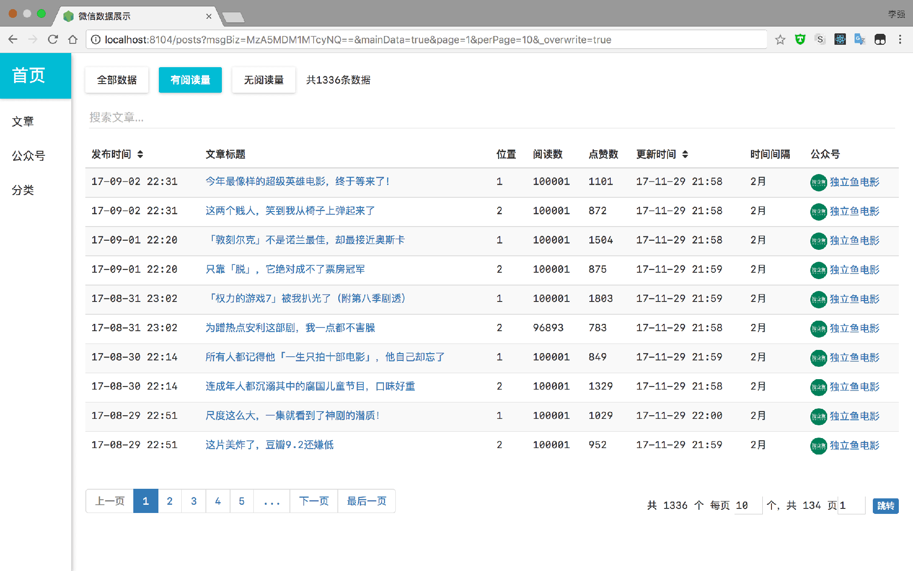

# wechat_spider 微信爬虫

基于 Node.js 的微信爬虫，通过中间人代理的原理，批量获取微信文章数据，包括阅读量、点赞量、评论和文章正文等数据。

使用代理模块 AnyProxy。代码已支持 AnyProxy 4 版本。

支持 Docker 部署。

## 开始

### 安装前准备

- 安装 Node，版本大于 8.8.1
- 安装 MongoDB，版本大于 3.4.6
- 安装 Redis

### 安装

```shell
git clone https://github.com/lqqyt2423/wechat_spider.git
cd wechat_spider
npm install
```

本项目基于代理模块 AnyProxy，解析微信 HTTPS 请求需在电脑和手机上都安装证书。可参考：[AnyProxy 文档](http://anyproxy.io/cn/#%E8%AF%81%E4%B9%A6%E9%85%8D%E7%BD%AE)。

### 通过 Docker 部署

```shell
git clone https://github.com/lqqyt2423/wechat_spider.git
cd wechat_spider
# build image
docker-compose build
# 运行实例
docker-compose up
# 终止运行
docker-compose down
```

- `Dockerfile` 中已经设置了在 `Linux` 环境的 Docker 中添加根证书的操作步骤，所以接下来仅需在手机上安装 https 证书即可。
- 最终手机上设置的代理 ip 还是需要以自己电脑上的 ip 为准，需忽略 Docker 实例中打印的 ip 地址
- 可编辑 `Dockerfile` 和 `docker-compose.yml` 改变部署规则

## 使用

```shell
cd wechat_spider
npm start
```

1. 确保电脑和手机连接同一 WIFI，`npm start` 之后，命令行输出`请配置代理: xx.xx.xx.xx:8101` 类似语句，手机设置代理为此 IP 和端口
2. 手机上测试打开任一公众号历史文章详情页和文章页，观察电脑命令行的输出，查看数据是否保存至 MongoDB

> - 如需测试自动翻页，可先多次分别打开不同的公众号的历史详情页，等数据库中有了翻页的基础公众号信息之后，再随便进入历史页等待翻页跳转
> - 翻页逻辑仅支持公众号历史页面跳公众号历史页面，微信文章页面跳微信文章页面，两个不同页面不能互相跳转

### 自定义配置

可编辑 `config.js` 文件进行自定义配置，文件中每个配置项都有详细的说明。

可配置项举例如下：

- 控制是否开启文章或历史详情页自动跳转
- 控制跳转时间间隔
- 根据文章发布时间控制抓取范围
- 是否保存文章正文内容
- 是否保存文章评论

### 可视化界面

前端页面已打包好，启动项目后，如无修改默认 `server port` 配置，浏览器直接访问 `http://localhost:8104` 即可。检测数据有无抓取保存直接刷新此页面即可。



前端页面由`React` 编写，如需修改，可编辑`client` 文件中的代码。

### MongoDB 数据信息

数据库 database: wechat_spider

数据表 collections:

- posts - 文章数据
- profiles - 公众号数据
- comments - 评论数据

### 从 MongoDB 导出数据

#### 命令行直接导出数据：

```shell
mongoexport --db wechat_spider --collection posts --type=csv --fields title,link,publishAt,readNum,likeNum,msgBiz,msgMid,msgIdx,sourceUrl,cover,digest,isFail --out ~/Desktop/posts.csv
```

#### 脚本导出：

文件 `/utils/exportData.js` 已经编写好成型的导出数据的方法，直接通过 `JavaScript` 调用即可。

## 抓取特定公众号历史链接的第二种方法

代码写在 `second/` 文件夹中，原理是通过微信公众平台的后台编辑文章时，可以通过转载查看其它公众号的文章列表。所以使用此方法的前提是要有微信公众号的账号，然后登陆进入后台，复制对应的 `cookie` 和 `token` 信息至 `config.js` 中。

经过测试，发现此方法会有频率的一些限制，且目前代码仅仅处于可以用的阶段，还需要做很多的优化，所以在此不再过多阐述。如果觉得此方法有用，可以参考 `second/` 文件夹中的代码逻辑，非常简单。

## 赞赏

如本项目对你有所帮助，可扫码赞赏。


## 付费 Support

我已经通过此项目累计抓取了 20w+ 多条数据，所以对于碰到不能获取阅读量、不能自动翻页等等问题而邮件我的，我一律不会回复的。代码就在这里，一些配置的问题，如不明白直接看代码，也不要再邮件我。

如果实在不明白，请先扫码赞赏，然后邮件联系我。

如需帮忙搭建抓取环境、更高级的功能定制或帮忙抓取数据等，也可邮件联系，价格都好商量。

邮箱： `974923609@qq.com`。

微信：


## License

[MIT](LICENSE)
