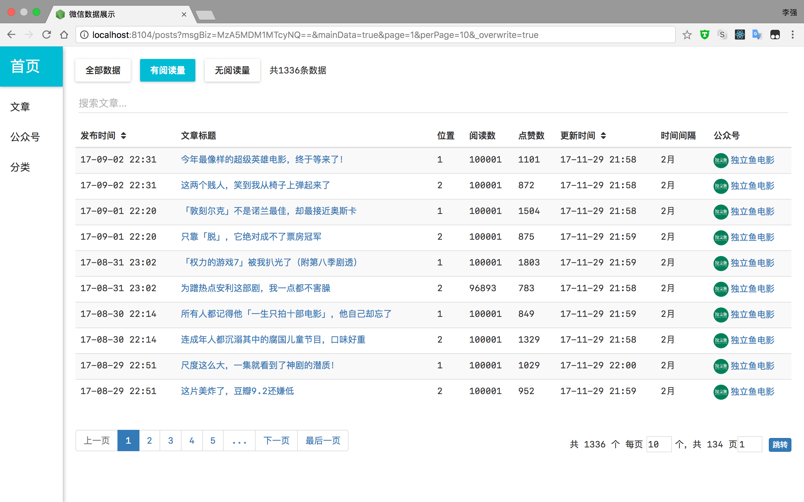

# wechat_spider 微信爬虫

基于Node 的微信爬虫，通过中间人代理的原理，批量获取微信文章数据，包括阅读量、点赞量和评论等数据。

使用代理模块AnyProxy。代码已支持AnyProxy 4版本。

## 开始

### 安装前准备

- 安装Node，版本大于 8.8.1
- 安装MongoDB，版本大于 3.4.6
- 安装Redis
- 安装Node 全局模块nodemon 和pm2

### 安装

```shell
git clone https://github.com/lqqyt2423/wechat_spider.git
cd wechat_spider
npm install
```

本项目基于代理模块AnyProxy，解析微信HTTPS 请求需在电脑和手机上都安装证书。可参考：[AnyProxy 文档](http://anyproxy.io/cn/#%E8%AF%81%E4%B9%A6%E9%85%8D%E7%BD%AE)。

## 使用

```shell
cd wechat_spider
npm start
```

1. 确保电脑和手机连接同一WIFI ，`npm start` 之后，命令行输出`请配置代理: xx.xx.xx.xx:8101` 类似语句，手机设置代理为此IP 和端口
2. 手机上测试打开任一公众号历史文章详情页和文章页，观察电脑命令行的输出，查看数据是否保存至MongoDB
3. 自动翻页抓取数据需配置`config.js`

### 自定义配置

目前可支持的配置项举例如下：

- 控制是否开启文章或历史详情页自动跳转
- 控制跳转时间间隔
- 根据文章发布时间控制抓取范围
- 是否保存文章正文内容
- 是否保存文章评论

可编辑`index.js` ，`config.js` 和`targetBiz.json` 进行自定义配置。文件中注释有详细说明。

### 可视化界面

前端页面已打包好，启动项目后，如无修改默认`server port` 配置，浏览器直接访问`http://localhost:8104` 即可。检测数据有无抓取保存直接刷新此页面即可。



前端页面由`React` 编写，如需修改，可编辑`client` 文件中的代码。

### MongoDB 数据信息

数据库database: wechat_spider

数据表collections:

- posts - 文章数据
- profiles - 公众号数据
- comments - 评论数据
- categories - 自定义的公众号分类


### 从MongoDB 导出数据

```shell
mongoexport --db wechat_spider --collection posts --type=csv --fields title,link,publishAt,readNum,likeNum,msgBiz,msgMid,msgIdx,sourceUrl,cover,digest,isFail --out ~/Desktop/posts.csv
```

以上命令会导出数据至桌面的`posts.csv` 中。具体的个性化导出请参考MongoDB 文档或者自己编写。

## License

[MIT](LICENSE)
